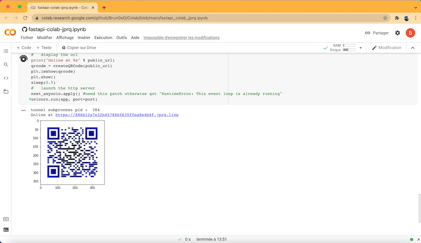
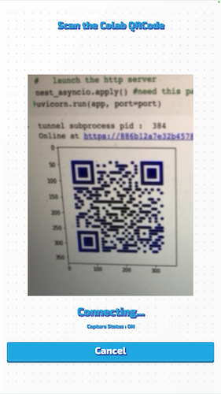
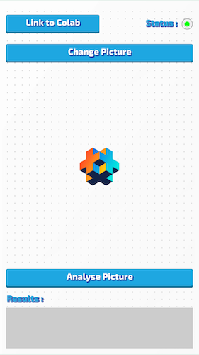
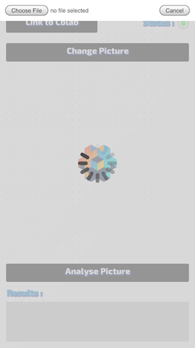
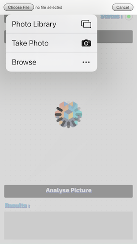
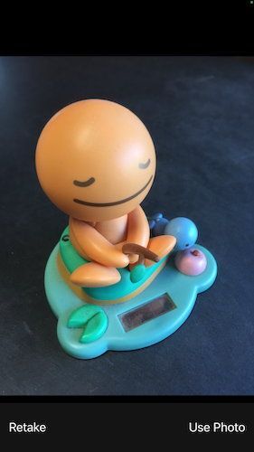
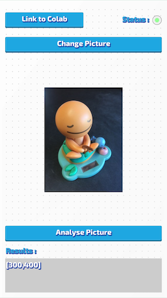

# Acces to a Google Colab notebook from a Defold application

## Overview
This project is much more a Proof Of Concept than a direct-to-use template.
It allows to exchange with a Google Colab notebook from a Defold application on a smartphone (validated on iOS device, this should also work on Android device subject to special permissions to be granted to access local photos...).  

The purpose of this project is to :

* perform and check a connection to a remote web server running on a colab notebook (the running notebook displays a qrcode, the defold application needs to scan it, a periodic check of connection is carried out, the connection status is displayed) ;
* send an image to this web server, the colab notebook analyses it and sends its results ;
* wait for the results ; 
* display the results when they are ready.   

**Notes:**

The colab notebook is available here :

    
There is not so much ambition in this colab notebook, apart from offering web services through [localtunnel](https://theboroer.github.io/localtunnel-www/) (a free and open-source Ngrok alternative) in order to communicate with this defold application (we just return the dimensions of the given image as a service), it's already not so bad...

You have to launch the colab notebook and scan the displayed QRCode with this defold application.

See the **main/screen.gui_script** file to see how it's implemented.

## Step by step in pictures

First, in your web browser, start the colab notebook execution :

From the defold application, scan the QRCode ():

Click on the **Change Picture** button :

Click on the **Choose File** button :

Click on the **Take Photo** button :

Click on the **Use Photo** button :

Click on the **Analyse Picture** button :

Have a look to the **Results** pannel :

Enjoy life and take a coffee (in any order you want)!

## Contributing
See [CONTRIBUTE.md](./CONTRIBUTE.md) for details about how to contribute to this project.

